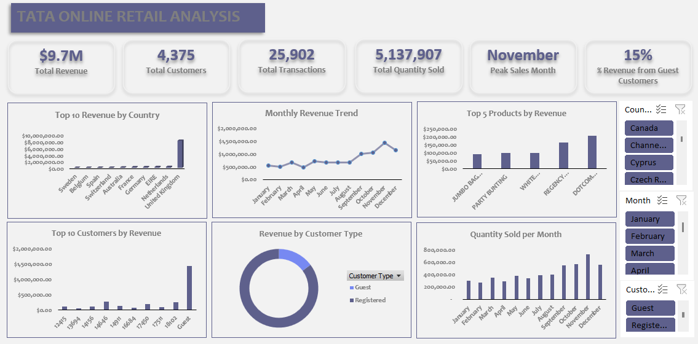

# TATA Online Retail Sales Analysis  
*By Toluwani Emmanuel*  

**Tool Used:** Microsoft Excel (Data Cleaning, PivotTables, Charts, Slicers)  

## Objective  
The goal of this project was to evaluate business performance for TATA Online Retail Store from both operational and marketing perspectives. The analysis uncovered key revenue drivers, customer behavior, and regional trends to support strategic planning for the upcoming year.  

## Data Preparation  
- Created a **Revenue column** by multiplying Quantity × Unit Price.  
- Engineered new fields for deeper analysis:  
  - **Transaction Type:** labeled zero quantity as “Return” and others as “Sales”.  
  - **Date Features:** extracted Date Only, Time Only, Month, and Day of Week from Invoice Date.  
  - **Customer Type:** classified blank Customer IDs as “Guest” and non-blank ones as “Registered”.  
- Added interactive **slicers** for Country, Month, and Customer Type.  

## KPIs Displayed  
- **Total Revenue:** ₦9,683,299  
- **Total Customers:** 4,375  
- **Total Transactions:** 25,902  
- **Total Quantity Sold:** 5,137,907 units  
- **Peak Sales Month:** November  
- **Revenue from Guest Customers:** 15%  

## Key Insights  
1. **Regional Performance:**  
   - United Kingdom dominates with over $8.1M in revenue.  
   - Sweden ranks lowest (~$36K), highlighting growth opportunities in underperforming regions.  

2. **Seasonality:**  
   - November is the peak month (₦1.44M revenue, 731K units sold).  
   - February is the weakest month (~₦500K revenue, 276K units sold).  

3. **Product Analysis:**  
   - **DOTCOM POSTAGE** leads with ₦206K revenue.  
   - **JUMBO BAG RED RETROSPOT** closes the top five with ₦92K.  
   - Identifies top products for bundling, upselling, and promotions.  

4. **Customer Insights:**  
   - Guest customers generated ₦1.43M, with one Guest being the top individual contributor.  
   - Registered customers account for 85% of revenue, Guests 15%.  
   - Anonymous buyers are valuable and worth targeting for registration and loyalty programs.  

## Recommendations  
- Double down on high-performing regions like the UK, while exploring growth strategies in markets like Sweden.  
- Capitalize on seasonal peaks (November) with targeted campaigns and inventory planning.  
- Encourage Guest customers to register by offering incentives.  
- Focus on top-selling products (e.g., DOTCOM POSTAGE) for bundling, upselling, and promotional strategies.  

## Outcome  
This dashboard provided a clear view of performance across regions, products, and customer types. It supports strategic decisions in marketing, operations, and customer engagement.  

## Screenshots  
  

## Live Walkthrough  
A live walkthrough of this project is available on my **LinkedIn profile**, where I explained the dashboard analysis and insights in real time.  
